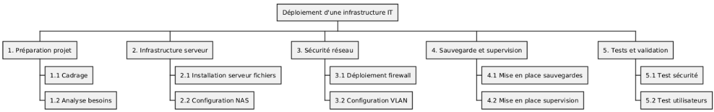

# challenges C01
Ces challenges sont un projet fil rouge a suivre toute la saison C01

## Énoncé E1
### Contexte
Vous êtes responsable de l'informatique au sein d'un campus de formation professionnelle (en présentiel 😁).

Le campus compte en permanence environ 500 personnes, entre les salariés (une quinzaine), les formateurs (freelances, formateurs occasionnels) et les apprenants (formation continue et alternance).

La direction vous demande de moderniser l’infrastructure IT du campus pour accueillir de nouveaux services numériques : serveurs fichiers, NAS, firewall, VLAN et accès sécurisé Wi-Fi.

Dans votre service, vous accueillez actuellement un alternant.

### Consignes
Rédigez la fiche de cadrage du projet comprenant :

* Objectifs du projet
* Périmètre et exclusions
* Parties prenantes (interne / externe)
* Livrables principaux
* Contraintes Qualité / Coût / Délai

### Notes
* Vous pouvez rédiger votre document avec l'outil de votre choix (Google Doc, fichier Markdown...)
* Gardez bien le fichier : il servira pour la suite !
* Prenez le temps de chercher de la documentation sur le sujet
* On ne demande pas d'être exhaustif, chaque partie peut ne contenir que quelques points

À faire également Lire le Manifeste pour le développement Agile de logiciels: https://agilemanifesto.org/iso/fr/manifesto.html

Commenter le Manifeste (questions, points positifs, critiques…) dans un fichier (libre choix de l’outil).

# Proposition de correction - Challenge E01
## Correction
## Fiche de cadrage du projet
### Contexte
Le campus souhaite moderniser son infrastructure IT afin de supporter de nouveaux services numériques répondant aux besoins des utilisateurs. Ce projet vise à garantir la disponibilité et la sécurité des services informatiques, tout en respectant les contraintes budgétaires et temporelles imposées. L'infrastructure modernisée doit faciliter l'accès aux ressources numériques pour l'ensemble des utilisateurs : apprenants, formateurs et personnel administratif.

### Objectifs du projet
Les objectifs principaux du projet sont les suivants :

* Déployer une infrastructure IT moderne et sécurisée, adaptée aux besoins actuels et futurs du campus.
* Assurer la continuité de service pour garantir un fonctionnement sans interruption des activités pédagogiques et administratives.
* Garantir l'intégrité, la confidentialité et la disponibilité des données hébergées sur l'infrastructure.
* Permettre une meilleure collaboration entre les utilisateurs grâce à un accès simplifié et sécurisé aux services numériques.
### Périmètre du projet
**Inclus dans le périmètre**
Le projet inclut la mise en œuvre des éléments suivants :

* **Serveur de fichiers centralisé** : mise en place d'un serveur permettant le stockage centralisé et le partage sécurisé des documents pour l'ensemble des utilisateurs du campus.
* **NAS (Network Attached Storage)** : déploiement d'une solution de stockage réseau dédiée à la sauvegarde automatique et à la restauration des données critiques.
* **Firewall avec segmentation VLAN** : installation et configuration d'un pare-feu pour sécuriser le réseau, accompagné d'une segmentation en réseaux virtuels (VLAN) pour isoler les différents types de trafic (administration, pédagogie, invités).
* **Accès Wi-Fi sécurisé** : déploiement d'un réseau sans fil couvrant l'ensemble du campus, avec authentification sécurisée et gestion des accès différenciés selon les profils utilisateurs.
* **Supervision et monitoring** : mise en place d'outils de surveillance de l'infrastructure permettant de détecter les incidents et d'anticiper les pannes.

### Exclus du périmètre
Les éléments suivants sont explicitement exclus du périmètre du projet :

* **Gestion des postes utilisateurs** : l'administration, la maintenance et le support des ordinateurs individuels ne font pas partie de ce projet.
* **Migration d'anciennes applications non critiques** : seules les applications essentielles au fonctionnement du campus seront prises en compte.
* **Développement d'applications métier spécifiques** : aucun développement logiciel sur mesure n'est prévu dans le cadre de ce projet.

### Parties prenantes
Les parties prenantes du projet se répartissent en acteurs internes et externes :

* **Direction du campus** : elle assure le rôle de sponsor du projet, valide les orientations stratégiques et arbitre les décisions importantes concernant le budget et les priorités.
* **Service IT** : composé des administrateurs systèmes et réseaux, ainsi que du responsable technique, ce service pilote la conception, le déploiement et la maintenance de l'infrastructure. L'alternant participe activement au projet sous supervision.
* **Fournisseurs externes** : ils assurent la fourniture du matériel réseau (switchs, routeurs, points d'accès Wi-Fi), des serveurs, du NAS, du firewall et des licences logicielles nécessaires.
* **Utilisateurs finaux** : les apprenants, les formateurs et le personnel administratif sont les bénéficiaires directs des services déployés. Leurs retours d'expérience permettront d'ajuster les solutions mises en place.

### Livrables principaux
Les livrables attendus tout au long du projet sont les suivants :

* **Fiche de cadrage du projet** : document définissant le contexte, les objectifs, le périmètre et les contraintes du projet.
* **WBS (Work Breakdown Structure)** : décomposition structurée du projet en tâches et sous-tâches, accompagnée d'un diagramme de Gantt pour planifier les différentes phases dans le temps.
* **Matrice RACI** : tableau précisant les rôles et responsabilités de chaque partie prenante (Responsable, Autorité, Consulté, Informé) pour chaque tâche du projet.
* **Registre des risques avec plan de traitement** : identification des risques potentiels (techniques, organisationnels, budgétaires) et définition des actions préventives ou correctives associées.
* **Mini-plan de reprise d'activité (PRA) et plan de continuité d'activité (PCA)** : documentation des procédures à suivre en cas d'incident majeur pour assurer la continuité des services critiques.
* **Tableau de bord de suivi de projet** : outil de pilotage permettant de suivre l'avancement du projet, les écarts par rapport au planning, le budget consommé et les indicateurs de qualité.

### Contraintes Qualité, Coût et Délai (QCD)
Le projet est soumis aux contraintes suivantes, qui constituent le triangle QCD :

* **Qualité** : l'infrastructure déployée doit être sécurisée, fiable et conforme aux standards techniques du secteur (normes ISO, bonnes pratiques ITIL, etc.). La solution doit garantir la disponibilité des services et la protection des données.
* **Coût** : le projet doit respecter le budget alloué par la direction. Les achats de matériel et de licences doivent être optimisés en comparant différentes offres et en privilégiant un bon rapport qualité-prix.
* **Délai** : le projet doit être réalisé dans un délai contraint de 5 semaines, de la phase de conception jusqu'à la mise en production de l'infrastructure.

### Méthode de gestion recommandée
Pour mener à bien ce projet, plusieurs approches méthodologiques peuvent être combinées :

* **Cycle en V** : cette méthode séquentielle structure le projet en phases distinctes (analyse des besoins, conception, réalisation, tests, validation). Elle permet de garantir que chaque étape est validée avant de passer à la suivante, ce qui est particulièrement adapté aux projets d'infrastructure où la sécurité et la fiabilité sont critiques.
* **Méthode Agile** : l'utilisation de sprints courts permet d'apporter de la flexibilité au projet. Des ajustements peuvent être réalisés rapidement en fonction des retours terrain ou des contraintes techniques découvertes en cours de route.
* **Approche DevOps** : cette approche favorise l'automatisation de la configuration des serveurs, du déploiement des services et des tests. Elle permet de gagner du temps, de réduire les erreurs humaines et d'assurer une mise en production plus rapide et fiable.

### Commentaires sur l'application des principes Agile
Bien que le projet repose sur une infrastructure technique, certains principes du manifeste Agile peuvent être appliqués avec profit :

* **Priorisation des fonctionnalités critiques** : la sécurité des accès (firewall, VLAN, Wi-Fi sécurisé) et la continuité de service (NAS, sauvegardes) doivent être traitées en priorité. Les fonctionnalités secondaires peuvent être déployées dans un second temps.
* **Collaboration continue** : des échanges réguliers entre l'équipe IT et les utilisateurs finaux (formateurs, apprenants, personnel) permettent de valider que les solutions répondent aux besoins réels et d'ajuster les configurations si nécessaire.
* **Réponse rapide aux changements** : la capacité à réagir rapidement face aux imprévus techniques (incompatibilité matérielle, problème de configuration, changement de priorité) est essentielle pour respecter le délai de 5 semaines.

## Énoncé E2
### Contexte
Vous êtes responsable de l'informatique au sein d'un campus de formation professionnelle (en présentiel 😁).

Le campus compte en permanence environ 500 personnes, entre les salariés (une quinzaine), les formateurs (freelances, formateurs occasionnels) et les apprenants (formation continue et alternance).

La direction vous demande de moderniser l'infrastructure IT du campus pour accueillir de nouveaux services numériques : serveurs fichiers, NAS, firewall, VLAN et accès sécurisé Wi-Fi.

Dans votre service, vous accueillez actuellement un alternant.

### Consignes
Hier vous avez créé la note de cadrage du projet.

Aujourd'hui on vous demande de créer un WBS avec plusieurs niveaux de tâches :

* Niveau 1 : grands lots (serveur, NAS, firewall, réseau)
* Niveau 2-3 : tâches et sous-tâches

### Notes
* Vous pouvez utiliser les outils de votre choix pour la représentation graphique
* Gardez bien le fichier : il servira pour la suite !
* Prenez le temps de chercher de la documentation sur le sujet

# Proposition de correction - Challenge E02
## Énoncé
### Contexte
Vous êtes responsable de l'informatique au sein d'un campus de formation professionnelle (en présentiel 😁).

Le campus compte en permanence environ 500 personnes, entre les salariés (une quinzaine), les formateurs (freelances, formateurs occasionnels) et les apprenants (formation continue et alternance).

La direction vous demande de moderniser l'infrastructure IT du campus pour accueillir de nouveaux services numériques : serveurs fichiers, NAS, firewall, VLAN et accès sécurisé Wi-Fi.

Dans votre service, vous accueillez actuellement un alternant.

### Consignes
Hier vous avez créé la note de cadrage du projet.

Aujourd'hui on vous demande de créer un WBS avec plusieurs niveaux de tâches :

* Niveau 1 : grands lots (serveur, NAS, firewall, réseau)
* Niveau 2-3 : tâches et sous-tâches

### Notes
* Vous pouvez utiliser les outils de votre choix pour la représentation graphique
* Gardez bien le fichier : il servira pour la suite !
* Prenez le temps de chercher de la documentation sur le sujet
## Correction
### Note
Le WBS (Work Breakdown Structure) est un outil essentiel en gestion de projet qui permet de décomposer le projet en lots de travail, tâches et sous-tâches. Cette décomposition hiérarchique facilite la planification, l'estimation des charges et l'attribution des responsabilités.
#

### WBS - Structure Work Breakdown
Le WBS du projet de modernisation de l'infrastructure IT se décompose en 5 grands lots, eux-mêmes subdivisés en tâches principales.

### Structure hiérarchique

1. Préparation projet
   1.1 Cadrage
   1.2 Analyse besoins

2. Infrastructure serveur
   2.1 Installation serveur fichiers
   2.2 Configuration NAS

3. Sécurité réseau
   3.1 Déploiement firewall
   3.2 Configuration VLAN

4. Sauvegarde et supervision
   4.1 Mise en place sauvegardes
   4.2 Mise en place supervision

5. Tests et validation
   5.1 Test sécurité
   5.2 Test utilisateurs

### Explication des lots de travail
**Lot 1 - Préparation projet** : ce lot regroupe toutes les activités préalables au déploiement technique. Il comprend la rédaction de la fiche de cadrage (déjà réalisée) et l'analyse détaillée des besoins des utilisateurs pour dimensionner correctement l'infrastructure.

**Lot 2 - Infrastructure serveur** : ce lot concerne la mise en place des solutions de stockage. Il inclut l'installation et la configuration du serveur de fichiers centralisé, ainsi que le déploiement du NAS pour la sauvegarde des données.

**Lot 3 - Sécurité réseau** : ce lot traite de la sécurisation de l'infrastructure réseau. Il comprend le déploiement du firewall pour protéger le campus contre les menaces externes, et la mise en place de VLAN pour segmenter le réseau et isoler les différents types de trafic.

**Lot 4 - Sauvegarde et supervision** : ce lot assure la pérennité et la surveillance de l'infrastructure. Il inclut la configuration des politiques de sauvegarde automatique et la mise en place d'outils de monitoring pour détecter les incidents.

**Lot 5 - Tests et validation** : ce lot final valide le bon fonctionnement de l'infrastructure avant sa mise en production. Il comprend des tests de sécurité (tests d'intrusion, vérification des règles firewall) et des tests utilisateurs pour s'assurer que les services répondent aux besoins.
#

### Représentation graphique avec PlantUML
PlantUML est un outil permettant de générer des diagrammes à partir de code textuel. Voici le code pour générer le WBS du projet :

```ruby
@startwbs
* Déploiement d'une infrastructure IT
** 1. Préparation projet
*** 1.1 Cadrage
*** 1.2 Analyse besoins
** 2. Infrastructure serveur
*** 2.1 Installation serveur fichiers
*** 2.2 Configuration NAS
** 3. Sécurité réseau
*** 3.1 Déploiement firewall
*** 3.2 Configuration VLAN
** 4. Sauvegarde et supervision
*** 4.1 Mise en place sauvegardes
*** 4.2 Mise en place supervision
** 5. Tests et validation
*** 5.1 Test sécurité
*** 5.2 Test utilisateurs
@endwbs
```

### Comment utiliser ce code PlantUML
Pour générer le diagramme à partir de ce code, vous pouvez :

* Utiliser l'éditeur en ligne PlantUML : https://www.plantuml.com/plantuml/uml/
* Installer l'extension PlantUML dans VS Code
* Utiliser un plugin PlantUML dans votre IDE préféré

Le diagramme généré affichera une structure arborescente claire du projet, facilitant la communication avec les parties prenantes.
#

### Points d'attention
Quelques éléments à garder à l'esprit lors de la création d'un WBS :

* Chaque tâche doit être clairement définie et mesurable
* Les lots de travail doivent être exhaustifs et couvrir l'ensemble du périmètre du projet
* La décomposition doit s'arrêter à un niveau permettant une estimation réaliste des charges
* Le WBS servira de base pour créer le planning (diagramme de Gantt) et attribuer les responsabilités (matrice RACI)



# challenge E03
## Énoncé
### Contexte
Vous êtes responsable de l'informatique au sein d'un campus de formation professionnelle (en présentiel 😁).

Le campus compte en permanence environ 500 personnes, entre les salariés (une quinzaine), les formateurs (freelances, formateurs occasionnels) et les apprenants (formation continue et alternance).

La direction vous demande de moderniser l’infrastructure IT du campus pour accueillir de nouveaux services numériques : serveurs fichiers, NAS, firewall, VLAN et accès sécurisé Wi-Fi.

Dans votre service, vous accueillez actuellement un alternant.

### Consignes
Vous avez créé la note de cadrage du projet ainsi que le WBS.

Aujourd'hui on s'attaque à l'analyse des risques !

1. Listez au moins 10 risques du projet (technique, humain, organisationnel)
2. Évaluez chaque risque :
    * Probabilité : faible/moyenne/forte
    * Impact : faible/moyen/critique
    * Criticité = probabilité × impact
3. Classez les risques par criticité

**Livrable attendu** : registre des risques avec évaluation

### Notes
* Vous pouvez utiliser les outils de votre choix pour le registre
* Gardez bien le fichier, ça peut toujours servir !
* Prenez le temps de chercher de la documentation sur le sujet
#
## Correction
L'analyse des risques est une étape cruciale dans la gestion de projet. Elle permet d'identifier en amont les événements potentiels qui pourraient compromettre le succès du projet et de mettre en place des actions préventives ou correctives.

Le registre des risques doit être un document vivant, mis à jour régulièrement tout au long du projet. Chaque risque identifié doit être évalué selon deux dimensions : sa probabilité d'occurrence et son impact sur le projet. Le croisement de ces deux critères permet de déterminer la criticité et donc la priorité de traitement.

Les risques peuvent être classés en trois grandes catégories :

* **Techniques** : liés aux choix technologiques, à la configuration ou à la fiabilité des équipements
* **Humains** : liés aux compétences, à la disponibilité ou aux erreurs des personnes impliquées
* **Organisationnels** : liés à la planification, aux processus ou aux parties prenantes externes
#
### Registre des risques du projet
Le tableau ci-dessous présente les 10 risques principaux identifiés pour le projet de modernisation de l'infrastructure IT du campus. Chaque risque est évalué et des actions de prévention sont proposées.

| **ID** | **Catégorie** | **Risque** |  **Probabilité** | **Impact** | **Criticité** | **Actions prévues / Prévention** | **Responsable** | 
| -------- | :-------: | :-------: | :-------: | :-------: | :-------: | :-------: |  :-------: | 
| 1 | Technique | Panne serveur pendant l'installation du NAS | Moyenne | Critique | Élevée | Prévoir serveur temporaire / tests préalables |  Administrateur SI | 
| 2 | Technique | Firewall mal configuré → coupure réseau | Moyenne | Critique | Élevée | Checklist configuration + revue par pair |  Administrateur SI | 
| 3 | Technique | Problème d'intégration VLAN → accès Wi-Fi instable | Moyenne | Moyen | Moyenne | Tests VLAN avant mise en production |  Réseau | 
| 4 | Technique | Incompatibilité avec équipements existants | Faible | Moyen | Faible | Audit du matériel et documentation |  DSI / RSSI |
| 5 | Humain | Erreur humaine lors de la configuration du NAS | Moyenne | Moyen | Moyenne | Procédures écrites + double vérification |  Alternant / Admin |
| 6 | Humain | Absence du freelance formateur pour tests réseau | Moyenne | Faible | Moyenne | Planification et validation de disponibilité |  Chef projet |
| 7 | Organisationnel | Retard dans la livraison du matériel | Moyenne | Moyen | Moyenne | Suivi fournisseur et planning ajusté |  Chef projet |
| 8 | Organisationnel | Dépendance sur alternant pour tâches critiques | Faible | Critique | Moyenne | Formation croisée + supervision |  DSI / Manager |
| 9 | Organisationnel | Changement de besoins des utilisateurs | Moyenne | Moyen | Moyenne | Atelier de validation / revue régulière |  Chef projet |
| 10 | Technique | Perte de données lors migration fichiers | Faible | Critique | Moyenne | Sauvegardes avant migration + test restauration |  Administrateur SI |

#

### Explication détaillée de tous les risques
Chaque risque identifié dans le registre nécessite une compréhension claire de ses causes, de ses conséquences potentielles et des mesures de prévention à mettre en œuvre.

### Risque 1 - Panne serveur pendant l'installation du NAS
Ce risque technique combine une probabilité moyenne d'occurrence avec un impact critique. Une panne du serveur principal pendant la phase d'installation du NAS pourrait interrompre les services du campus et compromettre la continuité pédagogique. Pour mitiger ce risque, il est recommandé de prévoir un serveur temporaire de secours et de réaliser des tests préalables en environnement isolé avant tout déploiement en production.

### Risque 2 - Firewall mal configuré → coupure réseau
Une erreur de configuration du firewall pourrait entraîner une coupure réseau complète du campus, affectant l'ensemble des utilisateurs. Pour prévenir ce risque, une checklist de configuration détaillée doit être établie et chaque étape doit faire l'objet d'une revue par un second administrateur (principe des quatre yeux). Des tests de connectivité doivent être réalisés progressivement avant la mise en production définitive. Une intervention en heure non ouvrée pourrait etre envisagée

### Risque 3 - Problème d'intégration VLAN → accès Wi-Fi instable
Ce risque technique présente une probabilité moyenne avec un impact moyen. Une mauvaise intégration des VLAN pourrait entraîner des problèmes de connectivité Wi-Fi, affectant particulièrement les utilisateurs nomades (formateurs freelances, apprenants en mobilité). Des connexions intermittentes ou des temps de latence élevés pourraient perturber les activités pédagogiques. Pour prévenir ce risque, des tests approfondis de la segmentation VLAN doivent être réalisés avant la mise en production, incluant des tests de charge et de basculement entre différents VLAN.

### Risque 4 - Incompatibilité avec équipements existants
Ce risque technique présente une probabilité faible mais un impact moyen. Certains équipements déjà en place (switches, routeurs, imprimantes réseau) pourraient ne pas être compatibles avec la nouvelle infrastructure, nécessitant des remplacements imprévus ou des configurations complexes. Pour anticiper ce risque, un audit complet du matériel existant doit être réalisé en amont du projet, accompagné d'une documentation précise des versions firmware et des protocoles supportés.

### Risque 5 - Erreur humaine lors de la configuration du NAS
Ce risque humain présente une probabilité moyenne avec un impact moyen. L'alternant, bien qu'encadré, pourrait commettre des erreurs lors de la configuration du NAS (droits d'accès incorrects, partages mal configurés, politiques de sauvegarde inadéquates). Ces erreurs pourraient entraîner des problèmes d'accès aux données ou des failles de sécurité. Pour mitiger ce risque, des procédures écrites détaillées doivent être mises à disposition et chaque configuration doit faire l'objet d'une double vérification par l'administrateur SI avant validation.

### Risque 6 - Absence du freelance formateur pour tests réseau
Ce risque humain présente une probabilité moyenne avec un impact faible. Les formateurs freelances ayant des emplois du temps variables, leur disponibilité pour participer aux tests utilisateurs du réseau Wi-Fi pourrait être limitée. Leur absence pourrait retarder légèrement la validation finale de l'infrastructure. Pour gérer ce risque, une planification anticipée des sessions de test doit être effectuée avec validation préalable de leur disponibilité, et des créneaux alternatifs doivent être prévus.

### Risque 7 - Retard dans la livraison du matériel
Ce risque organisationnel présente une probabilité moyenne avec un impact moyen. Les délais de livraison des équipements (serveurs, NAS, firewall, points d'accès Wi-Fi) peuvent être affectés par des ruptures de stock, des problèmes logistiques ou des retards fournisseurs. Ces retards pourraient décaler l'ensemble du planning du projet. Pour prévenir ce risque, un suivi régulier des commandes doit être effectué avec les fournisseurs, et le planning doit intégrer des marges de sécurité. Des fournisseurs alternatifs peuvent être identifiés en cas de besoin.

### Risque 8 - Dépendance sur alternant pour tâches critiques
Ce risque organisationnel présente une probabilité faible mais un impact critique. Si l'alternant se voit confier des tâches critiques sans supervision suffisante et qu'il devient indisponible (maladie, fin de contrat anticipée, absence), le projet pourrait être fortement impacté. Pour mitiger ce risque, une formation croisée doit être mise en place pour que plusieurs membres de l'équipe maîtrisent les aspects critiques du projet. L'alternant doit toujours être supervisé par un administrateur expérimenté sur les tâches sensibles.

### Risque 9 - Changement de besoins des utilisateurs
Ce risque organisationnel présente une probabilité moyenne avec un impact moyen. En cours de projet, les utilisateurs (direction, formateurs, apprenants) pourraient exprimer de nouveaux besoins ou modifier leurs exigences initiales (espaces de stockage supplémentaires, accès spécifiques, nouvelles segmentations réseau). Ces changements pourraient nécessiter des ajustements de configuration et impacter les délais. Pour gérer ce risque, des ateliers de validation réguliers doivent être organisés avec les parties prenantes, et un processus de gestion des changements doit être formalisé avec évaluation de l'impact avant acceptation.

### Risque 10 - Perte de données lors migration fichiers
Ce risque technique présente une probabilité faible mais un impact critique. Lors de la migration des données existantes vers le nouveau serveur de fichiers, des erreurs de transfert, des corruptions de fichiers ou des suppressions accidentelles pourraient survenir, entraînant une perte de données importantes pour le campus. Pour prévenir ce risque, des sauvegardes complètes doivent être réalisées avant toute migration, des tests de restauration doivent être effectués pour valider leur intégrité, et la migration doit être réalisée par phases avec validation progressive.
#
### Méthodologie d'évaluation
L'évaluation de chaque risque repose sur une grille de criticité croisant probabilité et impact :

**Probabilité d'occurrence** :

* **Faible** : risque peu probable de se produire
* **Moyenne** : risque ayant une probabilité modérée de se produire
* **Forte** : risque très probable de se produire

**Impact sur le projet** :

* **Faible** : conséquences mineures, sans impact majeur sur les délais, coûts ou qualité
* **Moyen** : conséquences significatives nécessitant des ajustements du planning ou du budget
* **Critique** : conséquences graves pouvant compromettre le succès du projet ou la continuité de service

**Criticité résultante** :

* **Élevée** : probabilité moyenne/forte ET impact critique → traitement prioritaire
* **Moyenne** : autres combinaisons nécessitant surveillance et actions préventives
* **Faible** : probabilité faible ET impact faible/moyen → surveillance simple
#
### Suivi et mise à jour du registre
Le registre des risques n'est pas un document figé. Il doit être mis à jour régulièrement lors des réunions de suivi de projet. De nouveaux risques peuvent apparaître en cours de route, et certains risques identifiés peuvent se concrétiser ou au contraire devenir caduques.

Pour chaque risque, le responsable désigné doit :

* Surveiller les indicateurs d'alerte
* Mettre en œuvre les actions préventives planifiées
* Réévaluer régulièrement la probabilité et l'impact
* Documenter les actions correctives si le risque se matérialise

Ce registre servira également de base pour alimenter le retour d'expérience (REX) en fin de projet. Sonnet 4.5Claude is AI and can make mistakes. Please double-check réponses.
#
## Énoncé E4
### Contexte
Vous êtes responsable de l'informatique au sein d'un campus de formation professionnelle (en présentiel 😁).

Le campus compte en permanence environ 500 personnes, entre les salariés (une quinzaine), les formateurs (freelances, formateurs occasionnels) et les apprenants (formation continue et alternance).

La direction vous demande de moderniser l’infrastructure IT du campus pour accueillir de nouveaux services numériques : serveurs fichiers, NAS, firewall, VLAN et accès sécurisé Wi-Fi.

Dans votre service, vous accueillez actuellement un alternant.

### Consignes
Vous avez créé la note de cadrage du projet, le WBS et le registre des risques.

Aujourd'hui on prépare la continuité et la reprise d’activité.

1. Définir un scénario d’incident majeur (panne totale serveur)
2. Décrire :
   * Mesures préventives
   * Procédures de reprise
   * Responsable et délai de restauration
3. Identifier les indicateurs de succès
**Livrable attendu** : mini-PRA ou PCA

### Notes
* Vous pouvez utiliser les outils de votre choix pour le registre
* Gardez bien le fichier, ça peut toujours servir !
* Prenez le temps de chercher de la documentation sur le sujet

# Correction
### Note pour le formateur
Le Plan de Reprise d'Activité (PRA) et le Plan de Continuité d'Activité (PCA) sont des documents essentiels pour garantir la résilience de l'infrastructure IT face aux incidents majeurs.

### Distinction PRA / PCA :

* Le **PRA** (Plan de Reprise d'Activité) définit les procédures à mettre en œuvre **après** un sinistre pour restaurer les services dans un délai acceptable.
* Le **PCA** (Plan de Continuité d'Activité) vise à **maintenir** les services critiques **pendant** l'incident grâce à des mesures préventives et des solutions de contournement.

Dans le cadre de ce projet, un mini-PRA/PCA permet d'anticiper les scénarios d'incident les plus probables et d'assurer la continuité des services pédagogiques et administratifs du campus.
#
### Analyse des menaces et vulnérabilités
Avant de définir le plan de reprise, il est essentiel d'identifier les principales menaces pesant sur l'infrastructure et les vulnérabilités associées. Le tableau ci-dessous recense les menaces critiques, les vulnérabilités exploitables et les mesures de sécurité correspondantes, en référence aux standards ANSSI et ISO 27001.

| **Menace** | **Vulnérabilité** | **Mesure sécurité** | **Référence ANSSI / ISO 27001** |
| ------- | :------: |  :------: | :------: | 
| Ransomware | OS non patché |  Patch OS + Antivirus + backup | ISO 27001 A.12.6 | 
| Phishing | Utilisateur non formé |  Sensibilisation + MFA | ANSSI Guide PRA-PCI | 
| Intrusion firewall | Règles mal configurées |  Audit + logging + alerting | ISO 27001 A.13.1 | 
| Panne NAS | Redondance absente |  RAID + sauvegarde hors site | ANSSI Recommandation Secu | 
| Coupure électricité | Pas d'UPS |  Installation onduleur | ISO 27001 A.11.2 | 

### Explication des menaces et mesures de sécurité
**Ransomware** : ce type d'attaque par rançongiciel peut chiffrer l'ensemble des données du serveur, rendant l'infrastructure inutilisable. La vulnérabilité principale réside dans les systèmes d'exploitation non mis à jour, qui présentent des failles de sécurité exploitables. Les mesures préventives incluent l'application régulière des correctifs de sécurité, le déploiement d'un antivirus avec protection en temps réel, et la mise en place de sauvegardes hors ligne régulières permettant une restauration des données même en cas de chiffrement.

**Phishing** : les attaques par hameçonnage exploitent le manque de vigilance des utilisateurs pour obtenir des identifiants d'accès ou installer des logiciels malveillants. Pour réduire cette vulnérabilité, des campagnes de sensibilisation régulières doivent être organisées auprès du personnel et des apprenants. L'activation de l'authentification multi-facteurs (MFA) constitue une barrière supplémentaire efficace contre l'utilisation frauduleuse de comptes compromis.

**Intrusion firewall** : une configuration incorrecte du pare-feu peut laisser des ports ouverts ou autoriser des flux non légitimes, exposant le réseau interne à des intrusions. Des audits réguliers de la configuration, associés à la mise en place de journalisation (logging) et d'alertes automatiques sur les tentatives de connexion suspectes, permettent de détecter et corriger rapidement les vulnérabilités.

**Panne NAS** : l'absence de redondance sur le système de stockage constitue un point de défaillance unique. La mise en place d'un système RAID permet de tolérer la panne d'un ou plusieurs disques sans perte de données. Les sauvegardes hors site (dans un autre bâtiment ou dans le cloud) garantissent une protection supplémentaire en cas de sinistre majeur (incendie, inondation).

**Coupure électricité** : une coupure prolongée de l'alimentation électrique peut entraîner l'arrêt brutal des serveurs et la corruption de données. L'installation d'onduleurs (UPS) permet de maintenir l'infrastructure opérationnelle pendant la durée nécessaire à une extinction propre des systèmes, voire de basculer sur un groupe électrogène pour les services critiques.
#

### Mini-Plan de Reprise d'Activité (PRA) / Plan de Continuité d'Activité (PCA)
Le plan ci-dessous se concentre sur le scénario d'incident le plus critique pour le campus : la panne totale du serveur de fichiers, qui concentre les données pédagogiques, administratives et les ressources partagées essentielles au fonctionnement quotidien.

**Scénario d'incident critique**

**Incident retenu** : panne totale du serveur de fichiers principal.

Ce scénario inclut les cas suivants :

* Défaillance matérielle (panne carte mère, alimentation, disques)
* Corruption logicielle majeure (système d'exploitation endommagé)
* Attaque par ransomware ayant chiffré les données
* Sinistre physique (incendie, dégât des eaux dans la salle serveurs)

**Mesures préventives**
Les mesures suivantes sont mises en place en amont pour réduire la probabilité de l'incident et en limiter l'impact :

* **Configuration RAID** : le serveur de fichiers utilise une configuration RAID 5 ou RAID 6 permettant de tolérer la défaillance d'un ou deux disques sans interruption de service.
* **Sauvegarde quotidienne** : des sauvegardes automatiques complètes sont réalisées chaque nuit sur le NAS secondaire. Une sauvegarde hebdomadaire est externalisée (stockage hors site ou cloud).
* **NAS secondaire** : un NAS de secours est maintenu en état de disponibilité permanente, synchronisé quotidiennement avec le serveur principal. Il peut prendre le relais en cas de défaillance du serveur principal.
* **Surveillance proactive** : des outils de monitoring surveillent en temps réel l'état du serveur (température, état des disques, charge CPU/mémoire) et génèrent des alertes en cas d'anomalie.
* **Onduleur (UPS)** : le serveur et le NAS sont protégés par un onduleur permettant de maintenir l'alimentation électrique pendant au moins 30 minutes en cas de coupure.

**Procédure de reprise d'activité**
En cas de panne totale du serveur de fichiers, la procédure suivante est déclenchée :

**Étape 1 - Détection et alerte (0 à 15 minutes)**

* Le système de monitoring détecte l'incident et envoie une alerte automatique à l'administrateur serveur.
* L'administrateur confirme l'incident et active la procédure de reprise.
* Une communication est envoyée aux utilisateurs pour les informer de l'incident et de la mise en œuvre de la solution de secours.

**Étape 2 - Bascule sur NAS secondaire (15 à 60 minutes)**

* Le NAS secondaire, déjà synchronisé avec le serveur principal, est activé comme serveur de fichiers temporaire.
* Les partages réseau sont reconfigurés pour pointer vers le NAS secondaire.
* Les utilisateurs peuvent accéder aux fichiers à partir des dernières sauvegardes disponibles (données de la veille au maximum).

**Étape 3 - Diagnostic et restauration (1 à 4 heures)**

* L'administrateur identifie la cause de la panne (matériel, logiciel, attaque).
* Si réparation possible : intervention technique pour remplacer le composant défaillant ou restaurer le système.
* Si réparation impossible : le NAS secondaire est confirmé comme solution permanente et un nouveau serveur est commandé en urgence.
* Restauration des données depuis la dernière sauvegarde complète sur le serveur réparé ou remplacé.

**Étape 4 - Tests de validation (3 à 4 heures)**

* *érification de l'intégrité des données restaurées par échantillonnage.
* Tests d'accès par profils utilisateurs (apprenant, formateur, administratif).
* Validation de la disponibilité de tous les partages réseau.

**Étape 5 - Retour à la normale et retour d'expérience**

* Bascule des utilisateurs vers le serveur restauré.
* Communication de reprise du service normal.
* Rédaction d'un compte-rendu d'incident et mise à jour du PRA si nécessaire.

**Responsable et délai de restauration**
* **Responsable principal** : Administrateur serveur (avec support de l'administrateur SI)
* **Responsable de communication** : Chef de projet (information direction et utilisateurs)
* **Délai cible de restauration (RTO - Recovery Time Objective)** : moins de 4 heures entre la détection de l'incident et le retour à un service opérationnel.
* **Perte de données maximale acceptable (RPO - Recovery Point Objective)** : 24 heures maximum (données de la dernière sauvegarde nocturne).

**Indicateurs de succès**
Les indicateurs suivants permettent de valider la réussite de la procédure de reprise :

* **Service accessible** : tous les utilisateurs peuvent accéder aux partages réseau et ouvrir leurs fichiers dans le délai imparti de 4 heures.
* **Intégrité des données confirmée** : les tests d'échantillonnage ne révèlent aucune corruption de fichiers, aucune perte de données récentes au-delà du RPO défini.
* **Satisfaction utilisateurs** : aucune plainte majeure concernant l'indisponibilité prolongée ou la perte de travail.
* **Documentation complète** : un rapport d'incident détaillé est rédigé, incluant la chronologie, les actions menées et les améliorations à apporter au PRA.
* **Respect du délai RTO** : la restauration complète est effectuée en moins de 4 heures comme spécifié.
#
### Points d'attention pour la mise en œuvre du PRA/PCA
Pour que ce plan soit opérationnel, plusieurs conditions doivent être remplies :

* **Tests réguliers** : le PRA doit être testé au moins deux fois par an dans des conditions réelles (simulation d'incident) pour vérifier que les procédures sont applicables et que les équipes sont formées.
* **Mise à jour continue** : le plan doit être actualisé à chaque évolution de l'infrastructure (ajout de serveurs, changement de fournisseur de sauvegarde, etc.).
* **Formation des équipes** : l'administrateur serveur et l'alternant doivent être formés aux procédures de reprise. Des fiches réflexes doivent être disponibles en cas d'urgence.
* **Documentation accessible** : le PRA doit être stocké à la fois en version numérique (accessible même en cas de panne du serveur principal) et en version papier pour consultation en situation de crise totale.
* **Validation des sauvegardes** : des tests de restauration doivent être effectués mensuellement pour garantir que les sauvegardes sont exploitables et complètes.